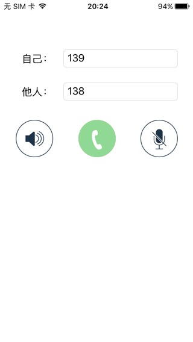

# feiyu-cloud-ios-voice-record-demo
飞语云平台iOS点对点通话录音Demo
此Demo用于演示，使用飞语SDK实现，点对点的，A呼叫B，的语音通话的演示。

内部是通过飞语的SDK包`FYRtcEngineKit`，发起`UDP`的数据包，实现了`VOIP`的语音通信。

前提：主叫A和被叫B的手机均已正常联网

# 代码逻辑
> 核心代码均在`ViewController.swift`

点对点的语音呼叫通话，且带录音的基本流程：

1.主叫和被叫都调用SDK初始化`sharedEngine`
```swift
fyRtcEngine = FYRtcEngineKit.sharedEngine(withAppId: FY_APPID, appToken: FY_APPTOKEN, delegate: self)
```
2.被叫一方需要先调用`calleePrepare`去让自己准备好被别人呼叫
```swift
fyRtcEngine.calleePrepare(selfUid, prepareSuccess: self.calleePrepareSuccess)
```

3.主叫方调用`dialPeer`
```swift
fyRtcEngine.dialPeer(otherUid, callerUid: selfUid, optionData: dialOption)
```

此时，主叫方自己会收到`outgoingCall`的回调

4.被叫方在`incomingCall`的回调中调用`answerCall`接听电话
```swift
    func onFYRtcEngine(_ engine: FYRtcEngineKit!, incomingCall caller: String!) {
        ...
        fyRtcEngine.answerCall()
        ...
    }
```

5.主叫方和被叫方均可正常通话，同时每隔2秒会收到`reportRtcStats`的语音统计信息

统计信息如下字段：
```swift
 "reportRtcStats: 累计发送字节数:\(status.sendBytes),累计接收字节数:\(status.recvBytes),下行带宽:\(status.downBandwidth),上行带宽:\(status.upBandwidth),发送丢包率:\(status.sendLossRate),接受丢包率:\(status.recvLossRate)"
```

6.想要挂掉，则调用`endCall`结束通话
```swift
fyRtcEngine.endCall(self.endCallCallback)
```

然后会收到回调`callEnd`
```swift
    func onFYRtcEngine(_ engine: FYRtcEngineKit!, callEnd status: FYRtcEngineStatus!) {
        self.infoNotice("通话结束: \(statusToShortStr(fyStatus: status))")
        
        self.afterCallEnd()
    }
```

## 代码说明
1. 如果你想要调试你自己的app，则需要去[飞语官网](https://www.feiyucloud.com)注册自己的app，获得`APPID`和`APPTOKEN`，替换`ViewController.swift`中的`FY_APPID`和`FY_APPTOKEN`
2. 相关文档：
    - [FeiyuCloud/objc-sdk-demo: Feiyu Cloud Objective-C SDK Demo](https://github.com/FeiyuCloud/objc-sdk-demo)
    - [点到点语音 · DOCS](https://feiyucloud.gitbooks.io/docs/content/test/dian-dao-dian-yu-yin.html#点到点语音相关delegate-方法fyrtcenginekitdelegate)
    - [API · PrivateDocs](https://feiyucloud.gitbooks.io/privatedocs/content/tong-xin-api-objective-c/api.html)


# 使用步骤

1. 用Xcode编译项目，安装到iPhone真机1，iPhone真机2中

- 真机1 主叫138:


- 真机2 被叫139:


2. 主叫138中，点击拨号按钮


3. 被叫139中会自动接听


同时主叫138也可以通话了：


## 使用说明
1. demo中的主叫和被叫的号码（138，和139）均可以自己随意改动，只是要确保互相设置的值是匹配即可。